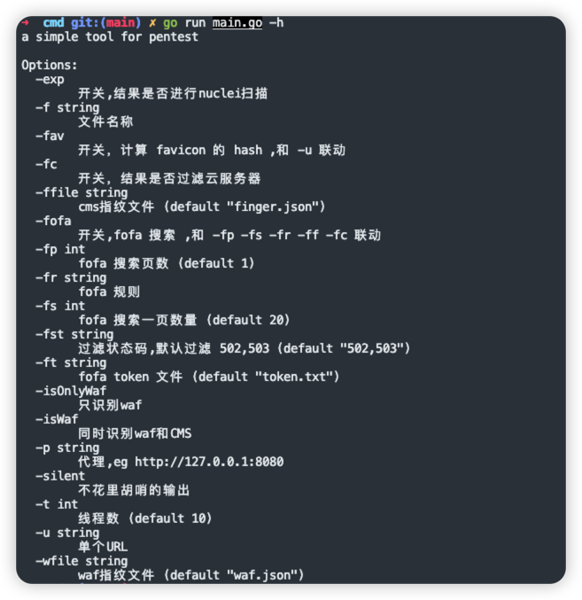

# GoFinger

指纹识别工具

之前使用的是其他大佬的工具，但有不少的个人需求，所以就二开了指纹识别工具，方便支持多个功能和解决BUG。

使用方法:

指纹识别工具最重要还是指纹添加，丰富自己的指纹库:
* 支持body、header、icon检测
* 每个识别都支持与或逻辑

具体参考指纹库文件 `finger.json`

此外还增加了多个辅助功能:

* WAF 指纹检测

* FOFA搜索

* 调用Nuclei

  
